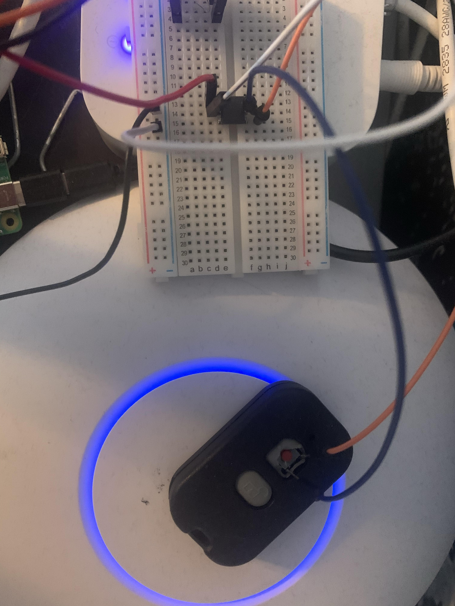

# Welcome to Matt's Home Automation!

### Introduction 

Towards the end of my second year, I began an interest in the HomeLab subreddit. I wanted to learn more about networking and develop a system I could experiment with new technologies. Unsure of where exactly to begin, I looked towards the most obvious and exciting option: home automation. Throughout the summer, I built open source solutions for lighting, temperature control, and security while learning about the psychological applications this data generates. 

### Stack

There are many players in the home automation market offering their own nuanced ecosystem. Amazon, Google, and Apple offer top tier software, device compatibility, and voice assistant, but lack developer control. They are centralized services that work out of the box, and for most consumers, that is the best option. Open source services such as Home Assistant or OpenHab offer a plug and play format that offers high compatibility while also giving the user more control over the tech. These great solutions inspired the functionality and design I wanted out of my system.

These specifications led me to a LAMP \(Linux, Apache, MySQL, PHP\) webserver. This traditional stack allowed me to control my devices from a web page anyone on the network/wifi could access. There was no separate app that would eliminate desktop access or necessitate my roommates to download \(further splitting into iOS/Android\). There was just a local IP that could be saved to any phone home screen. 

### Lighting

There are many options on the wifi lightbulb market, but I went with the name brand Philips hue lights. I connected the hub to my router and inserted the new lights throughout the house. The hub has a built-in API that one can interface to control the brightness, pigmentation, and state of groups of lights created within the Hue app. After grouping the lights to different rooms, I created a front end on the webserver. This would communicate with my PHP backend to send requests to the API. 


Built with HTML, CSS, and JavaScript, the front end enables one to turn the lights on/off with the lightbulb animation, adjust brightness with the slider, and select a pre-determined state \(menu pop up in the turquoise button\). 

The front end communicates with the backend through JavaScript AJAX calls to PHP functions. Let's look at an example. Here, the page loads and needs to adjust the slider to the brightness of the light group.   

```text
$.ajax({
        url:"/lighting/lightingPHP/getBri.php", 
        data: { groupid: "8" }, //matthews room check bri
        type: "GET",
        context: document.body
    }).done(function(result) {
        sliderMatthew.value = result;
    });
```

This AJAX calls getBri.php through its URL and takes an argument, the group ID. getBri then makes a call to the Hue API to understand the state of the brightness. 

```text
curl_setopt($ch, CURLOPT_URL, $url);
curl_setopt($ch, CURLOPT_HTTPHEADER, array('Content-Type: application/json'));
curl_setopt($ch, CURLOPT_CUSTOMREQUEST, 'GET');
```

This PHP code is a basic cURL which returns the data from the Hue API URL specified with the group ID. The result is then parsed and returned. As per the AJAX code, the slider is then set to the value. All lighting functions are designed in a similar fashion whether that is loading the page, turning a group off/on, adjusting brightness, or selecting a scene. 

### Security

To automate the security of my house, I first wanted to control my door lock. After researching different wifi solutions, I found many required their own app and could not be easily integrated into my network with an API. However, I came across Morning Industry - they manufacture a Radio Frequency Deadbolt that could be controlled from a small remote. I theorized I could control the remote with my Raspberry Pi, but I had to create some circuit to interface between the two.  



The remote button is activated when two pins are connected, so I soldered two wires to the respective pins \(blue and orange wires\) and connected the opposite end to an optoisolator on my breadboard. When the optoisolator receives power, \(red wire - white is connected to ground\) the connection between the output pins are completed, connecting the orange and blue wires and activating the remote to open the door. 

The hardware is done, but this Pi needs to open a means of communication with the web-server. Therefore, I created a python Flask API where I could receive requests and activate the remote. Flask is a micro web framework, perfect for my needs to send data back and forth. As seen in the front end image, the lock at the bottom of the screen sends an AJAX request.

```text
$.ajax({
    url:"http://192.168.6.37:5000/smartlock", 
    data: { }, //SET PARAM1 TO GROUP ID
    type: "GET",
    context: document.body
}).done(function(result) {
    alert(result)
});
```

The AJAX code sends a GET request to the Flask API: 

```text
class smartlock(Resource):
    def get(self):
        unlock()
        return jsonify({"get request" : "smart lock api"})

def unlock():
    GPIO.setmode(GPIO.BCM)
    GPIO.setup(24, GPIO.OUT) #led to gpio24
    GPIO.output(24, GPIO.HIGH)
    time.sleep(1)
    GPIO.output(24, GPIO.LOW)
    GPIO.cleanup()
```

Here the Pi sets a GPIO pin output to high and triggers the remote. In this way, I was able to control the RF Deadbolt from the web-server.

### Thermostat

* rp4 with temperature sensor wired to the ac
* made calls to flask api to check if user set temperature within period of time
* if no user temp, went off a hardcoded value

While there are many smart thermostats on the market, I needed an API versatile enough to fit into my ecosystem. Unfortunately, I could not find a suitable candidate within a reasonable price range. I did however find many people using their Pi as a thermostat. I researched the wiring for my AC system and wired a relay switch to my unit. I connected my Pi and a DHT11 temperature sensor.  


This system could easily work by checking the current temperature against a hardcoded array of values, but I wanted to be able to change the set temperature from the web-server. This required further development of the Flask API and a front-end to select temperatures. 


 The front end involves two sliders to dial the temperature and a set button which sends a POST request to the API. 

```text
$.ajax({
    url: "http://192.168.6.37:5000/secFloorTemp", 
    type: "POST",
    contentType: "application/json",
    data: JSON.stringify({"temperature" : temp }),
    context: document.body
}).done(function(result) {
});
```

The Flask API handles the POST by writing the specified temperature and time to a text file.

```text
class secFloorTemp_POST(Resource):
    def get(self):
        return getSecFloorTemp()
    def post(self):
        data = request.get_json()
        current_time = datetime.datetime.now(pytz.timezone('America/New_York')).replace(tzinfo=None)
        f = open("tempPost.txt", "w")
        f.write(data["temperature"] + "\n")
        f.write(str(current_time))
        f.close()
        return data
```

The Pi, when a GET request is made, now checks whether the set time is within one hour of the current time, and either turns the system off or on. If it is not within the hour period, the set temperature is a hardcoded value depending on the time of day. In the API, the function getSecFloorTemp\(\) returns the set temperature if within a one hour period, or -1 otherwise. 

```text
def getSecFloorTemp():
    f = open("tempPost.txt", "r")
    lines = f.readlines()
    try:
        post_time = datetime.datetime.strptime(lines[1], '%Y-%m-%d %H:%M:%S.%f')
    except:
        return -1
    f.close()
    current_time = datetime.datetime.now(pytz.timezone('America/New_York')).replace(tzinfo=None)
    time_difference_sec = (current_time - post_time).seconds
    if (time_difference_sec > 3600):
        return -1
    else:
        return float(lines[0])
```

The actual Python code within the thermostat Pi logically checks for the posted temperature and then the hardcoded value, turning the relay switch on or off:  

```text
postTemp = getPostTemp()
currTemp = getCurTemp() 
if postTemp != -1:
    if postTemp < currTemp: # or type(temp) is dict:
            relayON()
    else:
            relayOFF()
elif tempArr[current_hour] < currTemp:
    relayON()
else:
    relayOFF()
```

This is how the Pi thermostat functions. It may not support AI climate control or geofencing like a Nest, but it is well within my needs and I learned a lot. 

### Sensors

Sensors play a vital role in upgrading a home automation system from functioning to learning. Here we start to move away from the utilitarian aspects and focus on the behaviors we can quantify. On a surface level, sensors can tell us about the state of our home: moisture sensors can detect water leaks, motion sensors can tell us when the laundry is done, window and door sensors the security of the house, etc. This data quantifies the life of the house and is helpful to visualize how we interact with our environment.

  I added two door sensors connected to a z-wave stick to monitor how frequently my roommates and I enter/leave the house. This data was then recorded on the LAMP MySQL backend. I was about to add motion sensors, RFID tags, and other devices to quantify behavior, but thought it was too much of an invasion of privacy. In the next section, I will how these IoT sensors allow us to understand our behavior without bias. This data can be used in seemingly unimaginable ways in the future of psychology. 
















## Psychology implications of Smart Home Data 

I began my interest with smart home applications of a homelab. My goal was to aggregate data generated from within my own house and layer psychological principles to reach a greater understanding of some human behavior or cognition. After spending the summer reading about the implications of smart home technology in psychological research and building my own smart home \(with the intent of generating data for my own case study\), I have come to a greater understanding of this evolving technology's role in our daily lives, mental health, and medical needs.            


      The above picture relates different "assessment spaces." Interviews are first-person, active,  and in the laboratory, while smart home data is ecological,  passive, and third-person. Citation - Nelson BW, and Allen NB. “Extending the Passive-Sensing Toolbox: Using Smart-Home Technology in Psychological Science.” Perspectives on Psychological Science : A Journal of the Association for Psychological Science, vol. 13, no. 6, 2018, pp. 718–733., doi:10.1177/1745691618776008.

### Social Physics

Before we can understand the gravity of smart home data, I believe it is important to understand the larger picture the smart home fits into. This summer I read _Social Physics: How Social Networks Can Make Us Smarter_ by Alex Pentland. MIT's Dr. Pentland goes through his research and corporate experiments which harness consensual cell phone data and IoT sociometric sensors to monitor behavior. Social learning, or our ability to adapt to behaviors within communities, and idea flow, the extent to which our diverse network fosters new ideas, play central roles in the productivity and vitality of communities. 

In Pentland's experiments, he tweaks the idea flow to improve the environment. Let's look at an example - In 2008 Alex and his team were contacted by Bank of America to improve their call center productivity by measuring the \(AHT\) average handle time of calls. 23 employees were fitted with sociometric badges and monitored for a month, and found the greatest predictor of success was interaction and high-level engagement. Now, by altering the coffee breaks from one person at a time to everyone, the AHT time decreased and saved the company approximately 15 million a year. 

> "What we found was that engagment was the central predictor of productivity. Remeber that engagement is defined as idea flow within a work group; in this case, it was measured by computing the degree to which the work group members that each employee talks to also talk to each other. Controlling for all other factors, including length of employment and gender, workers who measured engagment was in the top third had productivity that measured more than 10 percent hgiher when compared to the typical employee. Thus, in this white collar operation, we again see that the concept of idea flow is key to understanding the relationship between productivity and interaction patterns. It appears that being in the loop allows employees to learn tricks of the trade-the kinds of tacit, detailed experience that seperates novices from experts-and is what keeps the idea machine efficiently ticking along." - Social Physis: How Social Networks Can Make Us Smarter


