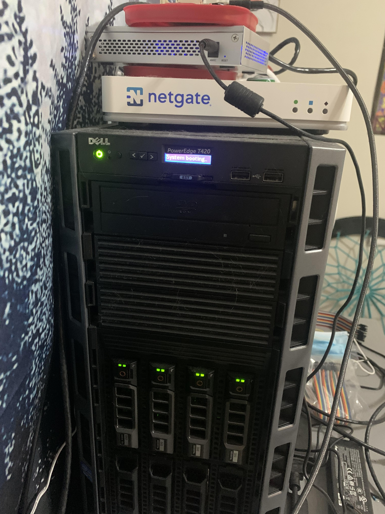
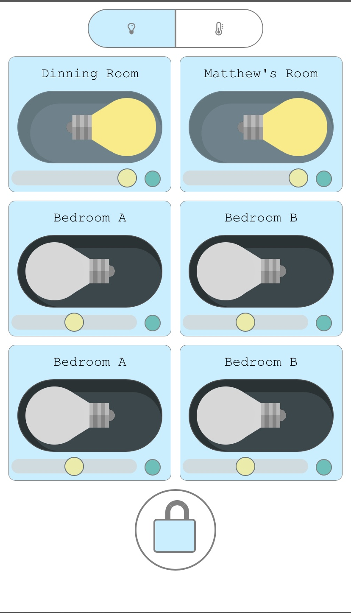
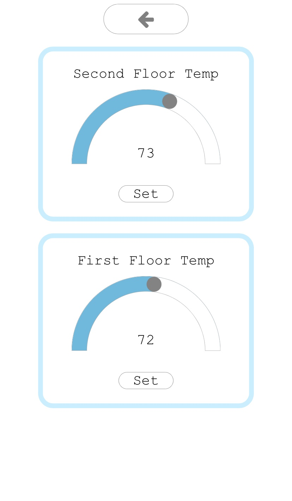
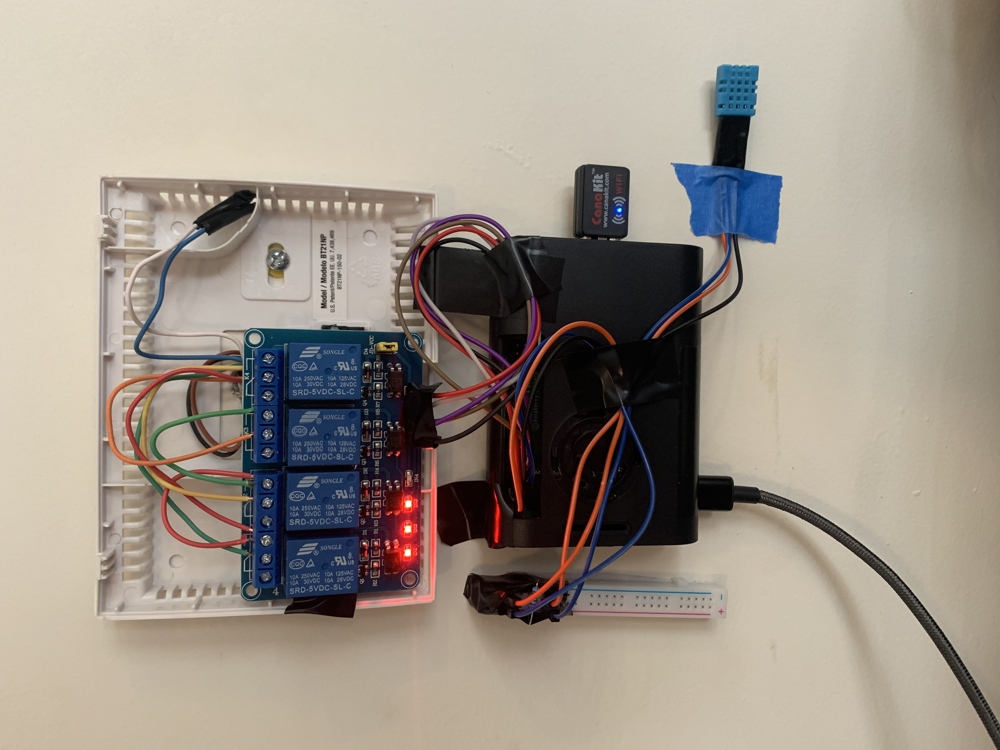
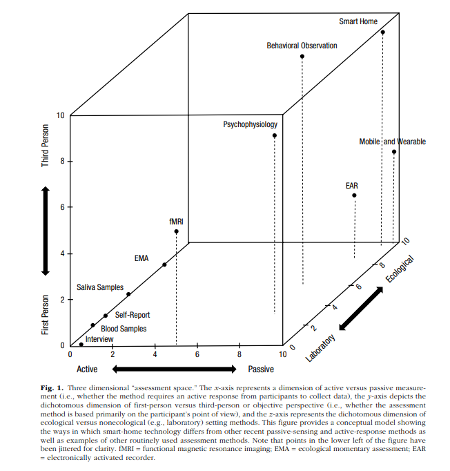

# Welcome to Matt's Home Automation!

### The Inspiration

Towards the end of my sophmore year, I started an interest in the HomeLab subreddit. People had grandiose racks of servers and networking equipment that blew my software limited mind. I decided to embark on my own homelab journey by building out a custom home automation system.     

### Beginnings

I began outlining the functionality and narrowed my focus to lighting, temperature, and security. I sought out a Dell T420 PowerEdge Server, Router, Switch, and Wireless Access Point to understand the secrets behind these homelab-er's enterprise networking setups. 

Now I was ready to rock - I installed pfSense on my router and went to work creating VLAN's for my Wifi, setting up a VPN for some VLAN's, tweaking firewall rules, and securing my network with Suricata IDS \(Intrusion Detection System\). 

Initially, I set up Proxmox virtualization software on the PowerEdge. I planned to set up my home automation web server on one virtual machine and separate other envioronments for a Python cryptocurrency trading bot and Plex Media Server. While I learned a lot about iDRAC and virtualization, it proved unnecessary long term. I transferred my web server to a Raspberry Pi 4 and suffered no loss of performance. 

### LAMP Web Server

After a fair amount of research into standard home automation software such as Home Assistant, OpenHab, Control 4, etcetera, I developed an understanding for front end layouts and integration of third-party devices. More importantly, I decided on a LAMP \(Linux, Apache, MySQL, PHP\) stack to build-out my own system.  

### Let There Be LIGHT!

The first application of any self-respecting home automation system has to be lighting.  

### Picking a Thermostat

While there are many smart thermostats on the market, I needed an API versatile enough to fit into my ecosystem. Unfortunately, I could not find a suitable candidate within a reasonable price range. Going forward with the theme of this project - I had to make my own. 

### Smart Lock Say What?















## Smart Home Data 

I began my interest with smart home applications of a homelab. My goal was to aggregate data generated from within my own house and layer psychological principles to reach a greater understanding of some human behavior or cognition. After spending the summer reading about the implications of smart home technology in psychological research and building my own smart home \(with the intent of generating data for my own case study\), I have come to a greater understanding of this evolving technology's role in our daily lives, mental health, and medical needs.            

## Limitations

Before I discuss my findings, it is important to understand and respect the limitations of smart home technology for varying use cases. I live with three roommates, so when I started planning the technology to integrate into the house, I had to keep the privacy of my roommates in mind.      

